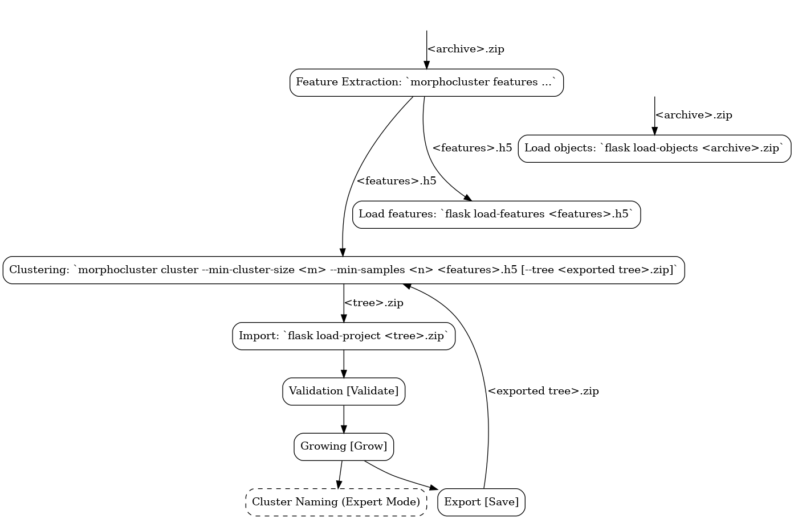

Morphocluster
=============

|Travis| |GPLv3 license|

.. |Travis| image:: https://travis-ci.org/morphocluster/morphocluster.svg?branch=master
    :target: https://travis-ci.org/morphocluster/morphocluster
    
.. |GPLv3 license| image:: https://img.shields.io/badge/License-GPLv3-blue.svg
   :target: LICENSE

..

    This repository contains the source code for the MorphoCluster application described in [Schroeder2020]_.

Installation (Web Application)
------------------------------

The web application runs in a Docker container.

0. Clone the morphocluster repository and checkout the current stable branch: ``git clone -b 0.2.x https://github.com/morphocluster/morphocluster.git``
1. Decide where to store the data, e.g. ``/data/morphocluster``, and create the required directories, e.g. ``mkdir -p /data/morphocluster``.
2. Make a copy of ``docker-compose.default.yml`` in the repository folder, name it ``docker-compose.yml`` and edit the relevant parts (e.g. paths, marked with `TODO`).
   Make a copy of ``environment.default.yml`` in the same directory, name it ``environment.yml`` and edit the relevant parts (e.g. for CUDA).
3. Open a shell in the repository folder and build environment: ``sudo docker-compose up --build``
   This will take a long while when run for the first time.
4. In a new terminal, connect to the MorphoCluster container and set it up:

   .. code:: sh

      $ sudo docker-compose exec morphocluster bash

      # Activate conda environment
      (base) root@abc123...:/code# . ./activate
      (morphocluster) root@abc123...:/code#

      # Create a user account
      flask add-user test-user
      Adding user test-user:
      Password: <hidden>
      Retype Password: <hidden>

5. Data preparation.
   MorphoCluster accepts input data in ZIP files containing the image files and an ``index.csv`` file with two columns:
   ``object_id`` (a unique identifier for every object) and ``path`` (image file path inside the archive).
   `EcoTaxa <https://ecotaxa.obs-vlfr.fr/>`_ export files have to be converted (see below).

   Place the image archive and the deep learning `model parameters <https://github.com/morphocluster/morphocluster/raw/fa9bec972596761f4f9acc1fa68ab238d2213262/data/model_state.pth>`_ into the data directory that is mounted inside the container.

   .. code:: sh

      # Connect to MorphoCluster container and set up the environment (if not done before)
      $ sudo docker-compose exec morphocluster bash
      (base) root@abc123...:/code# . ./activate
      (morphocluster) root@abc123...:/code#

      # Change into data directory
      $ cd /data

      # 0. Optionally convert EcoTaxa archive:
      $ morphocluster fix-ecotaxa archive.zip

      # 1. Calculate deep learning image features.
      # Using the GPU (see below) will considerably speed this up.
      # If --parameters-fn is not supplied, ImageNet-trained model weights will be used.
      # --input-mean and --input-std should then be supplied with the estimated mean color values.
      $ morphocluster features [--parameters-fn model_state.pth] [--input-mean 0.9,0.9,0.9] [--input-std 1,1,1] archive.zip features.h5

      # 2a. Cluster the features.
      $ morphocluster cluster [--pca 64] --min-cluster-size 128 features.h5 tree-128.zip

      # 2b. When repeating the clustering in the next iteration of the MorphoCluster process, supply the previously exported tree and reduce the cluster size.
      $ morphocluster cluster [--pca 64] --min-cluster-size 64 features.h5 tree-64.zip --tree /data/export/2020-05-15-10-34-34--3--tree-128.zip

      # 3. Import objects into the web application
      flask load-objects archive.zip

      # 4. Import features into the web application
      flask load-features [--pca 64] features.h5

      # 5. Import project into the web application
      flask load-project tree.zip

   Keep in mind that the paths are *inside* the Docker container, not on the host.

6. Connect to the MorphoCluster service using the browser (http://localhost:8000/).
   Validate and Grow the found clusters and save the result.
   It will be placed in ``/data/export/`` in the container.
7. Repeat clustering, tree import, validation and growing.

Flowchart
~~~~~~~~~

Prerequisites
~~~~~~~~~~~~~

- `Docker <https://docs.docker.com/engine/install/>`_ (Version 20 or higher)
- `Docker Compose <https://docs.docker.com/compose/install/>`_ (Version 1.25 or higher)
- The above steps were only tested on Linux.

GPU processing
~~~~~~~~~~~~~~

By default, MorphoCluster uses the CPU to calculate deep learning image features.
It is strongly advisable to use the GPU for that to speed up feature extraction dramatically.
To enable feature extraction on the GPU, modify ``environment.yml`` to exclude ``cpuonly`` and include the correct ``cudatoolkit`` version.
This has to be done before running ``sudo docker-compose up --build``.
Read about the `requirements for running CUDA containers <https://github.com/NVIDIA/nvidia-docker/wiki/CUDA>`_.

Currently, ``docker-compose`` does not directly support NVIDIA docker (see `#1073 <https://github.com/NVIDIA/nvidia-docker/issues/1073>`_, `#6691 <https://github.com/docker/compose/issues/6691>`_). 
It is therefore advisable to run the feature extraction direcly on the host.

SSH access
~~~~~~~~~~

For users without the privilege to execute docker commands on the host system (e.g. for security reasons), it is possible to connect to the docker container directly via SSH.

1. Make sure that port 22 is exposed in ``docker-compose.yml``.
2. Create a public key
   
   .. code:: sh

      # Generate key pair (if not done already):
      $ ssh-keygen -t rsa -b 4096

      # Show public key. Copy this to your clipboard.
      $ cat ~/.ssh/id_rsa.pub 
      # It looks a bit like this:
      ssh-rsa asdxyz ...

3. Create ``docker/morphocluster/authorized_keys`` from the ``docker/morphocluster/authorized_keys.default`` template
   and paste the public key created in the previous step.

4. After starting the morphocluster docker service,
   you can now connect to the docker container directly:

   .. code:: sh

      $ ssh root@host -p 8022 -i ~/.ssh/id_rsa -o PubkeyAuthentication=yes

      # Inside the container, change into /code and activate the environment
      $ cd /code
      $ . activate

.. [Schroeder2020] Schröder, S., Kiko, R., & Koch, R. (2020). "MorphoCluster: Efficient Annotation of Plankton images by Clustering" `arXiv:2005.01595 <http://arxiv.org/abs/2005.01595>`_.
