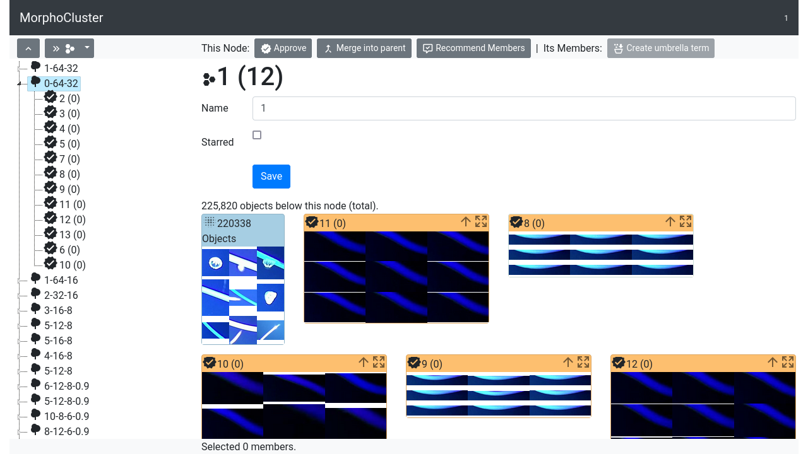
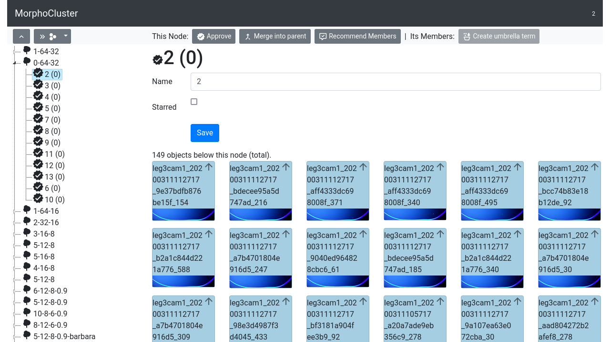
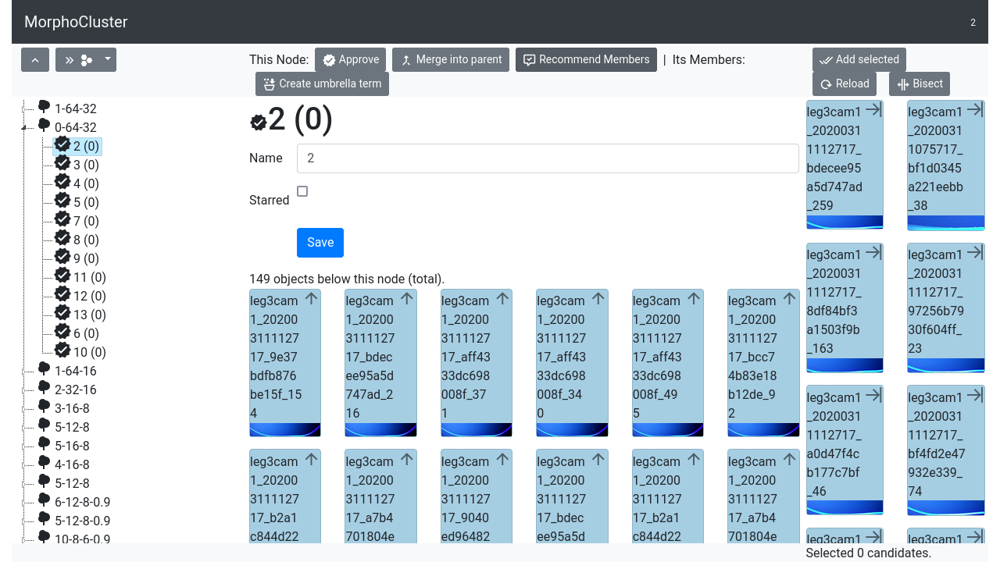

Expert Mode
===========

The "Expert Mode" is part of the MorphoCluster user interface.
It allows to edit the cluster tree, i.e. name clusters, create a hierarchy of clusters, and move clusters within this hierarchy.

Projects
--------
The tree pane on the left shows all projects. Opening a project displays its contained clusters.

Name a cluster
--------------
Select a cluster in the tree pane. Change the name in the corresponding form field and click "Save".

Display cluster members
-----------------------
Select a cluster in the tree pane.
If it contains sub-clusters (children), these will be shown by default.
If a cluster does not contain children, it is called a "leaf node", its objects will be shown by default.
To switch between both views, double-click on the first entry: "<n> Objects" (in child view) or "<n> Children" (object view).

Create a hierarchy of clusters
------------------------------

Open a cluster.
Select one or more objects in the member pane by drawing a rectangle around them or using Ctrl-click.
(Please note that the "header" of an object is its drag handle and can not be Ctrl-clicked.)
Click "Create umbrella term" (in the menu bar) to move these objects to a new child of the current cluster.

Move objects/clusters within the hierarchy
------------------------------------------
Open a cluster in child mode. Each child in the member pane has two controls:
Move Up (arrow up) moves the child up one level in the hierarchy.
Expand (expanding arrows) deletes the child and moves its children to the current node.

Moving new matching members into a cluster
------------------------------------------

Click "Recommend members" (in the menu bar) to open the recommendation view.
Based on the view setting in the member pane (child view or object view), clusters or objects are recommended.
Ctrl-click on matching object images and click "Add selected".
Click "Reload" to regenerate recommended members.
To select a whole range of objects (starting from the first object in the list), click on the arrow icon in the header of the last matching object.

Member recommendation can be used of efficiently build a cluster hierarchy based on cluster similarity.
